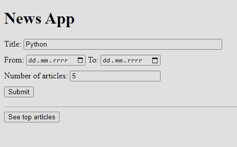
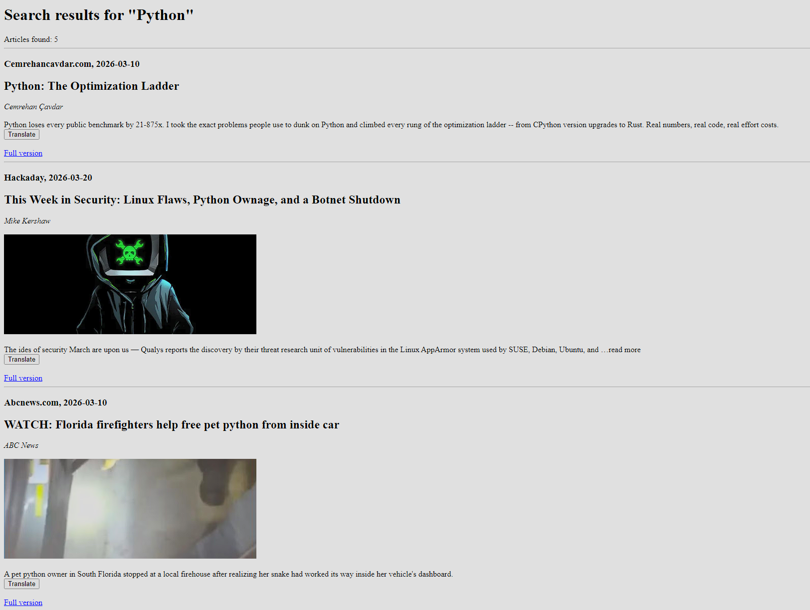

# News App

A simple web-based app for displaying summary of online news articles, created as a homework for Distributed Systems 
course. Created using FastAPI + Python. 
Application utilizes [NewsAPI](https://newsapi.org/) and [DeepL API](https://www.deepl.com/pl/translator).

## Functionality
- Search for articles with given topic and in given time range.
- Displaytheir brief descriptions (with link to full version of any given article).
- Discover trending articles.
- Translate articles to Polish (all the articles are automatically in English).

## Installation
1. Clone the repository: ```git clone https://github.com/krzysztof-kopel/NewsApp cd NewsApp```.
2. Install dependencies: ```pip install -r requirements.txt```.
3. Crete `.env` file and add your API keys (you can check .env.example for details).
4. Run the application: ```python main.py```.
5. The app will be available at `http://localhost:8000`.

## Screenshots

